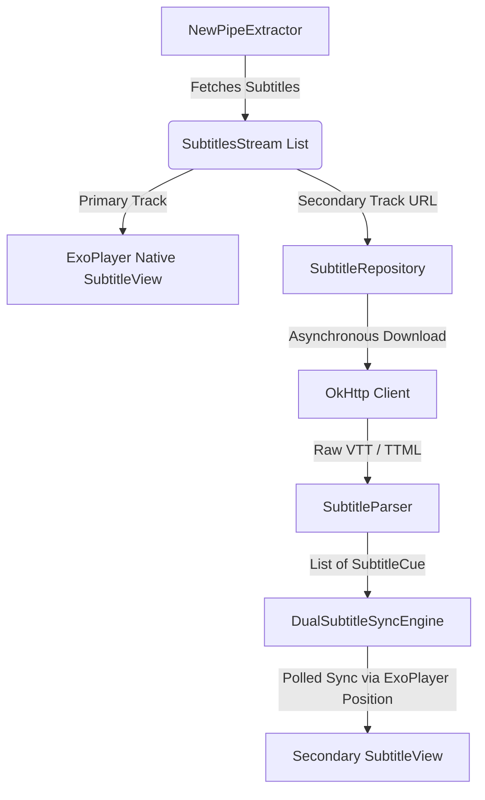

# Tubular with Dual Subtitles 

  

**Tubular with Dual Subtitles** is a premium, feature-rich fork of **Tubular** (which itself is a fork of **NewPipe** with SponsorBlock and ReturnYouTubeDislike integration) that adds support for displaying **two subtitles simultaneously** on screen. It is designed to be the ultimate companion for language learners and international content consumers.

---

## Key Features

* **Simultaneous Dual Subtitles:** Displays a secondary subtitle track positioned perfectly above the primary track. Both tracks are fully readable and do not overlap.
* **Zero-Cost Auto-Translation:** If a secondary language is not natively uploaded to the video, Tubular dynamically requests YouTube's auto-translated subtitle stream (by appending `&tlang=`) directly from YouTube's servers—completely free, with no translation APIs needed.
* **Ultra-Precise Hybrid Sync Engine:** A custom-built subtitle synchronization engine featuring:
  * **Binary Search Cue Lookup:** Extremely fast $O(\log n)$ lookup to ensure zero frame-time impact even on 1h+ videos.
  * **Seek Instant Update Hook:** Instantly updates subtitles (within 15ms) when seeking or rewinding.
  * **Dynamic Polling Intervals:** Adjusts polling speed automatically based on video playback rate (from 0.5x up to 3.0x speed).
  * **Countermeasures:** Robust handling of overlapping cues, gaps, and playback drift.
* **Persistent Language Selection:** Your secondary subtitle language selection survives device rotation (vertical to landscape) and transition between Main Player and Popup Player.
* **Sleek Integration & UI/UX:** A dedicated `2nd Caption` button in the player overlay opens a popup menu categorized into "None", "Available native languages", and "Translation targets".
* **Default Language Preference:** Configure your preferred default secondary language in Tubular settings (under Player settings).

---

##  Architecture

* **Primary Subtitle:** Managed entirely by ExoPlayer's native text track rendering for maximum efficiency.
* **Secondary Subtitle:** Handled by a hybrid engine. It downloads the subtitle format (supports both WebVTT and TTML), parses timestamps into absolute millisecond integer offsets, and polls ExoPlayer's current playback position to update the secondary `SubtitleView` at calculated intervals.

---

##  Build & CI/CD Setup

We use GitHub Actions to automate linting, checkstyle validation, and compiling. This allows you to compile the app without installing the Android SDK locally.

* **Quick Build (on push):** Compiles the debug APK as fast as possible.
* **Build Debug APK (feature branches & manual):** Runs full compile, checkstyle, and Kotlin ktlint verification before producing the APK.
* **CI Build (on Pull Requests):** The quality gate pipeline that runs full code verification, Checkstyle/ktlint, and Unit Tests.

To download the compiled APK:
1. Go to the **Actions** tab of your repository.
2. Click on the latest workflow run.
3. Scroll down to the **Artifacts** section and download `Tubular_*.apk`.

---

##  License

This project is licensed under the **GNU GPLv3** license. See the [LICENSE](LICENSE) file for details.

---

##  Credits

* **NewPipe** - The original lightweight YouTube client for Android.
* **Tubular** - The SponsorBlock & ReturnYouTubeDislike fork.
* **ExoPlayer/Media3** - High-performance media playback library for Android.
